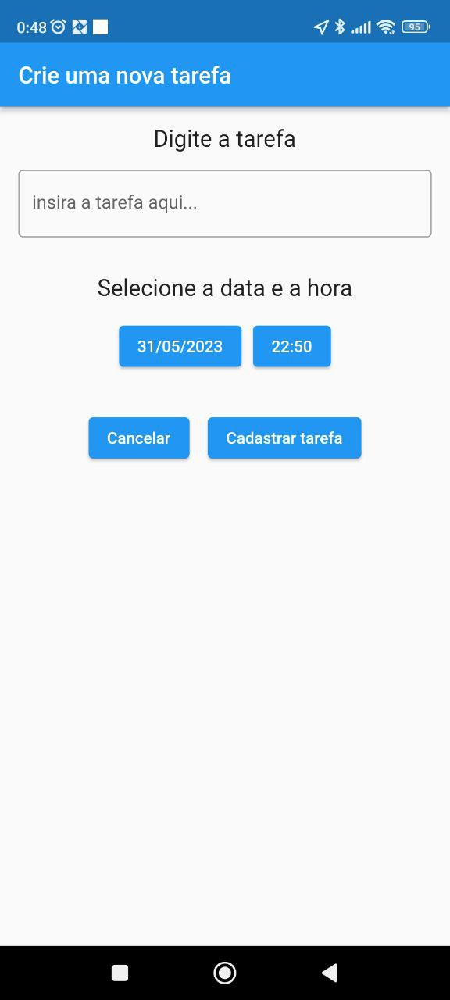
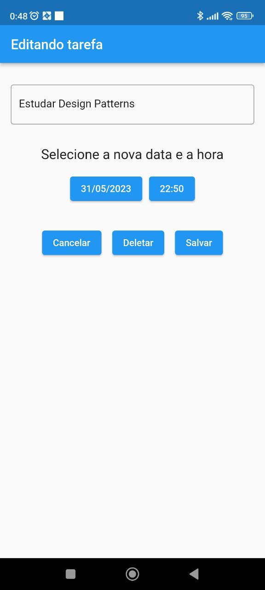
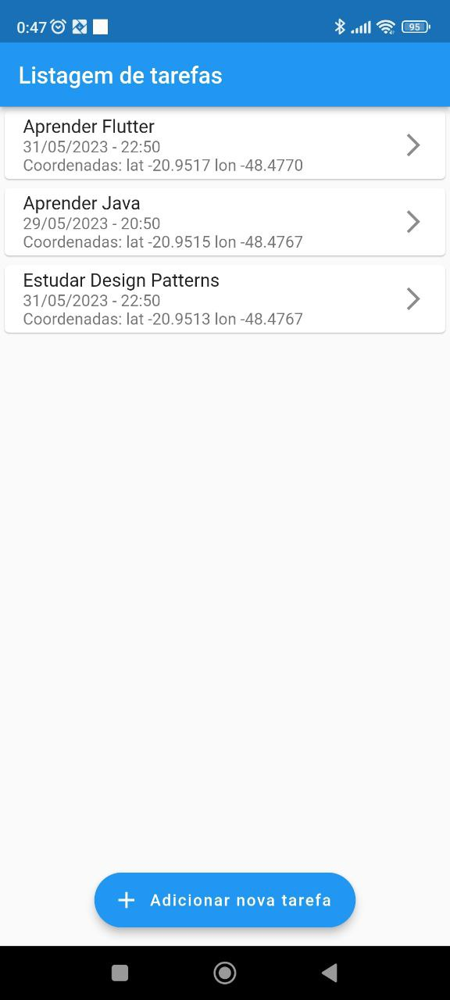
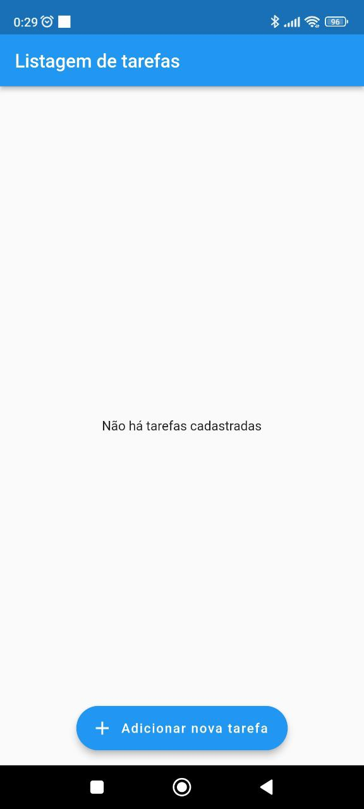

# To-do List
App made in Flutter that lists tasks the user inserted on app execution

## Tecnologies

- Flutter
- Routes
- Providers

## App prints:

##Create a new task

##Edit task

##Task list

##Empty task list

